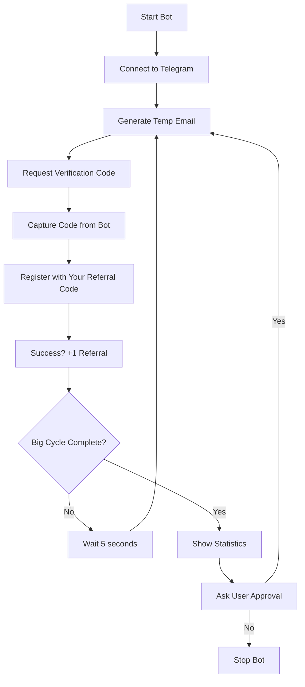

# 🤖 Simplus Auto Referral Bot

[](https://python.org)
[](LICENSE)
[](https://github.com/devtint/EDUnalPurposeOnly)

> **Automated referral generation bot for Simplus platform using temporary emails**

## 🎯 Purpose

This bot automates the process of generating referrals for your Simplus account by:
- Creating temporary email addresses
- Registering new accounts with your referral code  
- Managing verification codes automatically
- Tracking your referral progress

**Each successful registration counts as a referral to YOUR account, helping you earn rewards and bonuses!**

---

## ⚠️ Important Disclaimer

```
🚨 EDUCATIONAL PURPOSES ONLY 🚨

This project is created strictly for educational and learning purposes.
Users are responsible for:
- Compliance with platform terms of service
- Adherence to local laws and regulations  
- Ethical usage and respect for rate limits
- Understanding potential risks and consequences

The authors are not responsible for any misuse or violations.
```

---

## ✨ Features

| Feature | Description |
|---------|-------------|
| 🔄 **Automated Email Generation** | Uses Telegram bot for temporary emails |
| 📧 **Smart Verification** | Automatically captures and processes OTP codes |
| 📊 **Progress Tracking** | Real-time statistics and success rates |
| 🎛️ **Cycle Management** | Organized in batches of 50 with user approval |
| 📱 **Telegram Integration** | Seamless bot communication |
| 🛡️ **Error Handling** | Robust error recovery and timeout management |
| 📈 **Statistics Dashboard** | Detailed success/failure analytics |

---

## 🚀 Quick Start

### Prerequisites

- **Python 3.7+** installed on your system
- **Telegram account** with API access
- **Stable internet connection**
- **Simplus account** with referral code

### 1. 📥 Installation

```bash
# Clone the repository
git clone https://github.com/devtint/EDUnalPurposeOnly.git
cd EDUnalPurposeOnly

# Install dependencies
pip install telethon requests
```

### 2. 🔑 Get Telegram API Credentials

1. Visit [my.telegram.org](https://my.telegram.org)
2. Log in with your phone number
3. Go to **"API Development Tools"**
4. Create a new application
5. Save your `API_ID` and `API_HASH`

### 4. 📧 Setup TempMail Bot

**IMPORTANT**: Before running the script, you must activate the TempMail bot:

1. **Open Telegram** and search for `@TempMail_org_bot`
2. **Click "Start"** to activate the bot
3. **Generate a test email** by clicking "➕ Generate New / Delete"
4. **Verify it works** - you should receive a temporary email address

> ⚠️ **Critical**: The script will fail if @TempMail_org_bot is not started and working properly!

### 5. ⚙️ Configuration

Open `automated.py` and update these values:

```python
# Replace with your actual credentials
API_ID = 'your_api_id_here'           # From my.telegram.org
API_HASH = 'your_api_hash_here'       # From my.telegram.org  
PHONE_NUMBER = '+1234567890'          # Your phone with country code

# Most Important: Change to YOUR referral code
"invitation_code": "YOUR_REFERRAL_CODE_HERE"  # This generates referrals for YOU
```

### 6. 🎮 Run the Bot

```bash
python automated.py
```

---

## 📖 How It Works



### Process Flow

1. **🔌 Connection**: Bot connects to Telegram and temp mail service
2. **📧 Email Generation**: Creates temporary email address  
3. **🔐 Verification**: Requests and captures verification code
4. **✅ Registration**: Registers new account with YOUR referral code
5. **📊 Tracking**: Updates statistics and continues cycle
6. **🎯 Batching**: Processes in groups of 50 with approval gates

---

## 🎛️ Configuration Options

### Cycle Management
```python
CYCLES_PER_BIG_CYCLE = 50  # Referrals per batch
WAIT_TIME_BETWEEN_CYCLES = 5  # Seconds between attempts
```

### Timeout Settings
```python
EMAIL_TIMEOUT = 30  # Max wait for email generation
CODE_TIMEOUT = 60   # Max wait for verification code
```

---

## 📊 Output Example

```
🤖 SIMPLUS FULLY AUTOMATED REFERRAL BOT
🚀 Starting fully automated referral generation...
📋 Big Cycle = 50 referrals | Approval required after each Big Cycle

==================================================
🔄 STARTING CYCLE 1
==================================================

🔄 Generating new temporary email...
✅ Email extracted: temp123@example.com
✅ Verification code sent to: temp123@example.com
⏳ Waiting for verification code...
✅ Verification code extracted: 123456
✅ Registration completed for: temp123@example.com
✅ CYCLE 1 COMPLETED SUCCESSFULLY!

📊 Statistics: 1/1 successful | Big Cycle 1: 1/50
```

---

## 🔧 Troubleshooting

### Common Issues

| Problem | Solution |
|---------|----------|
| **API Credentials Invalid** | Double-check API_ID and API_HASH from my.telegram.org |
| **Phone Number Issues** | Use international format: +1234567890 |
| **TempMail Bot Not Working** | Start @TempMail_org_bot in Telegram first, generate test email |
| **Timeout Errors** | Check internet connection, verify TempMail bot is responding |
| **Verification Failed** | Ensure temp mail bot is responding and messages are received |
| **Rate Limiting** | Reduce frequency or take breaks |

### Debug Mode

Enable detailed logging by adding:
```python
import logging
logging.basicConfig(level=logging.DEBUG)
```

---

## 📈 Best Practices

### ✅ Recommended
- Monitor success rates and adjust timing
- Take breaks between big cycles  
- Keep API credentials secure
- Test with small batches first
- Respect platform rate limits

### ❌ Avoid
- Running 24/7 without breaks
- Sharing API credentials
- Ignoring error messages
- Excessive rapid requests
- Using on production accounts initially

---

## 🛡️ Security Notes

- **🔐 Never commit API credentials to version control**
- **🗂️ Session files contain login data - keep private**
- **🔄 Rotate credentials periodically**
- **📊 Monitor usage to avoid account restrictions**
- **🚫 Don't share session files**

---

## 📁 Project Structure

```
📂 EDUnalPurposeOnly/
├── 📄 automated.py          # Main bot script
├── 📄 README.md            # This documentation  
├── 📄 LICENSE              # MIT License
├── 📄 .gitignore           # Git exclusions
├── 📄 requirements.txt     # Dependencies
└── 📂 .git/               # Git repository
```

---

## 🤝 Contributing

We welcome contributions! Here's how:

1. **🍴 Fork** the repository
2. **🌿 Create** a feature branch (`git checkout -b feature/amazing-feature`)
3. **💾 Commit** your changes (`git commit -m 'Add amazing feature'`)
4. **📤 Push** to branch (`git push origin feature/amazing-feature`)
5. **🔄 Open** a Pull Request

### Development Setup
```bash
# Clone your fork
git clone https://github.com/yourusername/EDUnalPurposeOnly.git

# Create virtual environment
python -m venv venv
source venv/bin/activate  # On Windows: venv\Scripts\activate

# Install dev dependencies
pip install -r requirements.txt
```

---

## 📊 Statistics & Analytics

The bot provides comprehensive tracking:

- **📈 Success Rate**: Percentage of successful referrals
- **⏱️ Timing**: Average time per cycle
- **🔄 Cycles Completed**: Total and current big cycle progress  
- **🎯 Efficiency**: Referrals per hour/day
- **📉 Error Analysis**: Common failure points

---

## 🆘 Support

### Getting Help

1. **📚 Check Documentation**: Read this README thoroughly
2. **🐛 Search Issues**: Look for existing solutions
3. **💬 Create Issue**: Provide detailed error information
4. **📧 Contact**: Reach out for complex problems

### Issue Template
```
**Environment:**
- OS: [Windows/Mac/Linux]
- Python Version: [3.x.x]
- Error Message: [Full error text]

**Steps to Reproduce:**
1. ...
2. ...

**Expected vs Actual Behavior:**
...
```

---

## 📜 License

This project is licensed under the [MIT License](LICENSE).

```
MIT License

Permission is hereby granted, free of charge, to any person obtaining a copy
of this software and associated documentation files (the "Software"), to deal
in the Software without restriction, including without limitation the rights
to use, copy, modify, merge, publish, distribute, sublicense, and/or sell
copies of the Software, subject to the following conditions:

The above copyright notice and this permission notice shall be included in all
copies or substantial portions of the Software.

THE SOFTWARE IS PROVIDED "AS IS", WITHOUT WARRANTY OF ANY KIND.
```

**Educational Use Disclaimer:** This software is provided for educational purposes. 
Users are responsible for ensuring compliance with platform terms of service and applicable laws.

---

## 🙏 Acknowledgments

- **TempMail Bot** - For providing temporary email service
- **Telethon Library** - Excellent Telegram API wrapper  
- **Requests Library** - HTTP requests made simple
- **Community Contributors** - Bug reports and improvements

---

## 📞 Contact

- **GitHub**: [@devtint](https://github.com/devtint)
- **Project**: [EDUnalPurposeOnly](https://github.com/devtint/EDUnalPurposeOnly)

---

<div align="center">

**Made with ❤️ for Educational Purposes**

*Use responsibly and ethically*

[⭐ Star this repo](https://github.com/devtint/EDUnalPurposeOnly) • [🐛 Report Bug](https://github.com/devtint/EDUnalPurposeOnly/issues) • [✨ Request Feature](https://github.com/devtint/EDUnalPurposeOnly/issues)

</div>